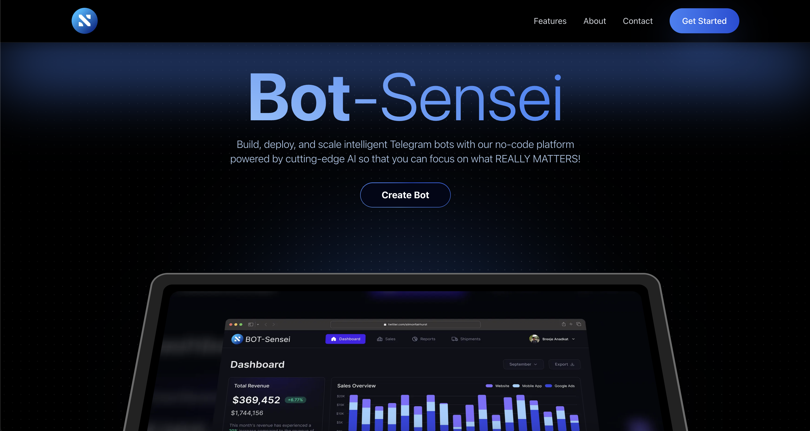

# BOT-Sensei - Next.js SaaS Landing Page Template



**BOT-Sensei** is a modern **Next.js + Tailwind CSS SaaS landing page template** designed for AI/chatbot businesses, educational platforms, and SaaS products. Perfect for companies looking to showcase their AI-powered solutions with a professional and engaging online presence.

## ✨ Key Features

- 🚀 Built with Next.js 14 and Tailwind CSS
- 💻 Fully responsive design
- 🎨 Clean and modern UI
- ⚡ Optimized performance
- 🔒 TypeScript support
- 📱 Mobile-first approach
- 🎯 SEO-friendly
- 🌙 Dark mode support

## 🔥 Live Demo

Check out the live demo here 👉 [https://botsensei.vercel.app/](https://botsensei.vercel.app/)

## 🚀 Getting Started

This is a [Next.js](https://nextjs.org/) project bootstrapped with [`create-next-app`](https://github.com/vercel/next.js/tree/canary/packages/create-next-app).

### Prerequisites

- Node.js 18+ 
- npm/yarn/pnpm/bun

### Installation

1. Clone the repository:
```bash
git clone https://github.com/yourusername/bot-sensei.git
```

2. Install dependencies:
```bash
cd bot-sensei
npm install
# or
yarn install
# or
pnpm install
# or
bun install
```

3. Run the development server:
```bash
npm run dev
# or
yarn dev
# or
pnpm dev
# or
bun dev
```

4. Open [http://localhost:3000](http://localhost:3000) with your browser to see the result.

## 📁 Project Structure

```
bot-sensei/
├── app/
│   ├── components/
│   ├── layout.tsx
│   └── page.tsx
├── public/
│   └── images/
├── styles/
│   └── globals.css
├── types/
└── utils/
```

## 🛠 Tech Stack

- [Next.js 14](https://nextjs.org/)
- [Tailwind CSS](https://tailwindcss.com/)
- [TypeScript](https://www.typescriptlang.org/)
- [Geist Font](https://vercel.com/font)

## 📝 Customization

You can start editing the page by modifying `app/page.tsx`. The page auto-updates as you edit the file.

This project uses [`next/font`](https://nextjs.org/docs/app/building-your-application/optimizing/fonts) to automatically optimize and load Geist, the custom font family from Vercel.

## 🚀 Deployment

The easiest way to deploy your Next.js app is to use the [Vercel Platform](https://vercel.com/new?filter=next.js).

Check out the [Next.js deployment documentation](https://nextjs.org/docs/app/building-your-application/deploying) for more details.

## 📚 Learn More

To learn more about the technologies used in this template:

- [Next.js Documentation](https://nextjs.org/docs) - Next.js features and API
- [Learn Next.js](https://nextjs.org/learn) - Interactive Next.js tutorial
- [Tailwind CSS Documentation](https://tailwindcss.com/docs) - Utility-first CSS framework

## 💬 Support

For support, please email harshiltomar20@gmail.com or wmemon100@gmail.com or open an issue on the repository.

## 📄 License

This project is licensed under the MIT License - see the [LICENSE](LICENSE) file for details.

## 🤝 Contributing

Contributions are welcome! Please feel free to submit a Pull Request.

## 🙏 Acknowledgments

- [Vercel](https://vercel.com) for hosting infrastructure
- [Tailwind CSS](https://tailwindcss.com) for the utility-first CSS framework
- [Next.js](https://nextjs.org) team for the amazing framework

---

Made with ❤️ by [Harshil](https://github.com/harshiltomar) and [Wasim](https://github.com/wmemon)